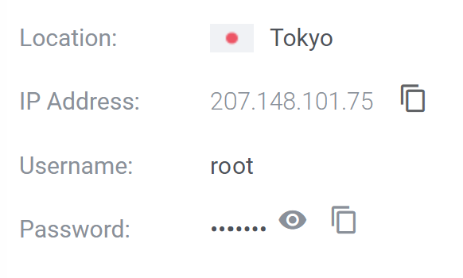
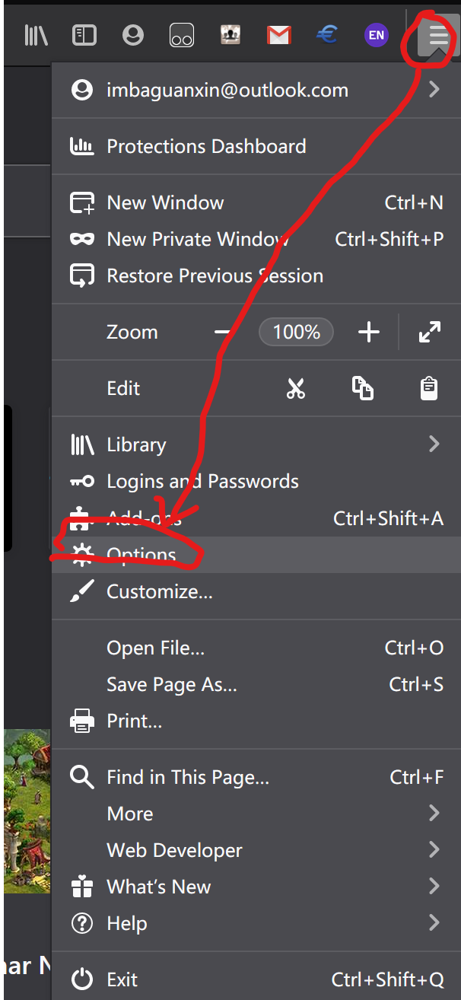
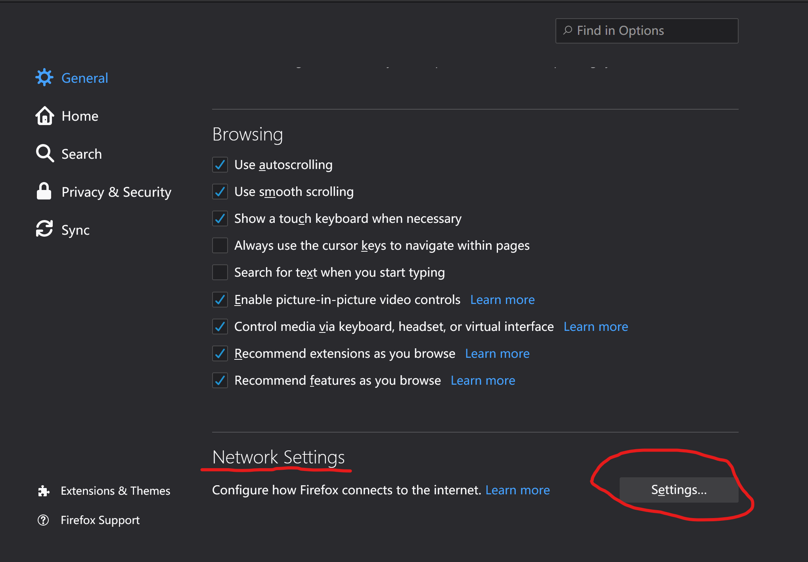
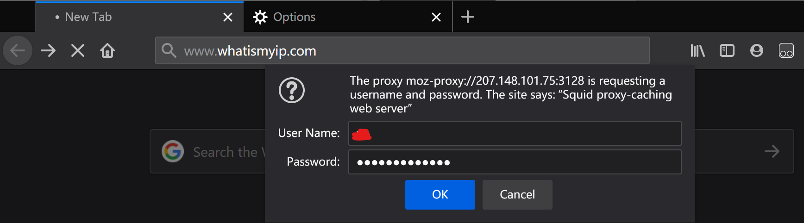

# Setting up a HTTP proxy based on ubuntu server

Build your own proxy. Hide youself on Internet. Break the Great Firewall.

# Table of Contents

- [Setting up a HTTP proxy based on ubuntu server](#setting-up-a-http-proxy-based-on-ubuntu-server)
- [Table of Contents](#table-of-contents)
- [Introduction](#introduction)
- [Steps and Guide](#steps-and-guide)
  - [Connect to your server](#connect-to-your-server)
  - [Install Squid Proxy and set up authentication](#install-squid-proxy-and-set-up-authentication)
    - [Install squid](#install-squid)
    - [Install apache2-utils](#install-apache2-utils)
  - [Generate authentication](#generate-authentication)
  - [Configure Squid Proxy authentication](#configure-squid-proxy-authentication)
  - [Test from the client side](#test-from-the-client-side)

# Introduction

This guide is about setting up a **HTTP proxy server** on a **ubuntu machine** based on **Apache Squid**

This guide will offer instructions on:

- connect to your server from your local machine
- setup proxy server on your remote proxy server
- build authentication of the proxy
- test the proxy

This guide will not offer instructions on:

- How and where to buy a remote server
- Setting up the remote server
- Basic commands in shell
- Interacting with a command line based user interface and text editor

# Steps and Guide

## Connect to your server

Before buying the server, please set the operating system of the server to be `Ubuntu 18.04` or some newer version.

After you buy your server, either a physical server or a virtual private server, your server provider will give you the `username`, `IP address` and `password` to access the server. 

Here is a example from server provider: 



Open up a terminal window. For Windows 10 users, just use `Powershell` and for MacOs/Linux users, just use `terminal`. 

Open a new terminal/powershell window, type:
```shell
ssh [username]@[your server ip]
```
please replace the information in brackets to your access information. Usually the username is **root** for the highest level authentication. 

If you are connecting to your server for the first time, there might be a prompt asking whether to trust the domain, just type `yes` to continue.

If you see something like:
```shell
Welcome to Ubuntu 20.10 (GNU/Linux 5.8.0-25-generic x86_64)

 * Documentation:  https://help.ubuntu.com
 * Management:     https://landscape.canonical.com
 * Support:        https://ubuntu.com/advantage

  System information as of Wed Dec  9 05:57:51 AM UTC 2020

  System load:  0.0                Processes:             109
  Usage of /:   14.2% of 23.38GB   Users logged in:       0
  Memory usage: 32%                IPv4 address for ens3: 207.148.101.75
  Swap usage:   0%

 * Introducing self-healing high availability clusters in MicroK8s.
   Simple, hardened, Kubernetes for production, from RaspberryPi to DC.

     https://microk8s.io/high-availability

27 updates can be installed immediately.
0 of these updates are security updates.
To see these additional updates run: apt list --upgradable

root@[your server host company name]:~#
```
It means you have successfully logged in to the server.

## Install Squid Proxy and set up authentication

This guide is using the opensourced Apache Squid to build the proxy server. We need install the `squid` for proxy server and `apache2-utils` for authentication.

### Install squid
```shell
sudo apt-get install squid
```
Once the Squid is installed, you can check the status of the Squid service with following command:
```shell
systemctl status squid
```
You should get output similar to:
```shell
● squid.service - Squid Web Proxy Server
     Loaded: loaded (/lib/systemd/system/squid.service; enabled; vendor preset>
     Active: active (running) since Fri 2020-12-04 03:51:13 UTC; 5 days ago
       Docs: man:squid(8)
   Main PID: 48604 (squid)
      Tasks: 5 (limit: 1065)
     Memory: 22.6M
     CGroup: /system.slice/squid.service
             ├─ 48604 /usr/sbin/squid --foreground -sYC
             ├─ 48606 (squid-1) --kid squid-1 --foreground -sYC
             ├─ 48607 (logfile-daemon) /var/log/squid/access.log
             ├─136618 (pinger)
             └─136619 (basic_ncsa_auth) /etc/squid/passwd
```
There is one line showing `active (running)` means you have successfully start the service.

### Install apache2-utils

Use following command:
```
sudo apt-get install apache2-utils
```

## Generate authentication

This part shows how to set up the authentication based on **username** and **password**

Use following command:
```shell
cd /etc/squid/
htpasswd -c .squid_users [username]
```
replace the [username] to username you like.

Then it should prompt out:
```
New password:
Re-type new password:
Adding password for user [username]
```
Just enter a password you like for that user.

Then check the the password file by typing:
```shell
cat /etc/squid/.squid_users
```
You should get outputs like: Username:randompasswords
```
john:$apr1$5o0XKeto$m6c5B5KK5ZAK/7A/VIgYB/
```
The squid user should be able to read this file. Therefore, run the command to set proper permisiions:
```
chown squid /etc/squid/.squid_users
```

## Configure Squid Proxy authentication

Since all seems fine, proceed to setup squid proxy basic authentication. Open the squid configuration file (`/etc/squid/squid.config`) for editing and add the authentication contents.

Use a text editor to open the config file. (Here I use vim)
```
vim /etc/squid/squid.config
```
Then paste the follwoing lines to the file and save it.
```shell
auth_param basic program /usr/lib64/squid/basic_ncsa_auth /etc/squid/.squid_users
auth_param basic children 5
auth_param basic realm Proxy Authentication Required
auth_param basic credentialsttl 2 hours
auth_param basic casesensitive off

acl auth_users proxy_auth [username1] [username2] [...]
http_access allow auth_users
```

replace the [username] with your username set above.

As a brief overview of the lines set above;

- The first line tells the Squid to use the basic_ncsa_auth helper program and find the usernames and password in `/etc/squid/.squid_users` file.
- The line `auth_param basic children 5` specifies the maximum number of squid authenticator processes to spawn.
- `auth_param basic realm` specifies the protection scope which is to be reported to the client for the authentication scheme.
- `auth_param basic credentialsttl 2 hours` specifies how long squid assumes an externally validated username:password pair is valid for
- `auth_param basic casesensitive off` specifies if usernames are case sensitive.
- `acl auth_users proxy_auth [username1] [username2] [...]` defines Squid authentication ACL for users that are allowed to authenticate.

The default port is `3128`. If you would like to customize the port number, just add lines in config file:
```shell
http_port [port number you like]
```
replace the brackets with your port number.

Once you are done with the configurations, save the file and restart squid:

```
systemctl restart squid
```

## Test from the client side

We are using a `FireFox` browser to test the proxy.

Open `FireFox` and go to option.



Then go to `Network Settings`



Select Manual proxy configuration and enter the IP of your server and the port (default is 3128, enter your own if you changed it). Please check `Also use this proxy for FTP and HTTPS` as well. 


Then press ok.

Go to [www.whatismyip.com](https://www.whatismyip.com/) to check your ip. When you are trying to access the website, the browser will ask you for authentication. Enter correct username and password to continue.



Press ok to continue. Check whether your ip has changed to your server's ip. If it changed, then the proxy is working.

